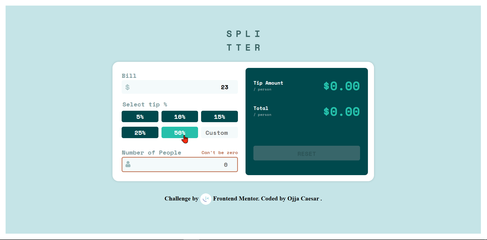
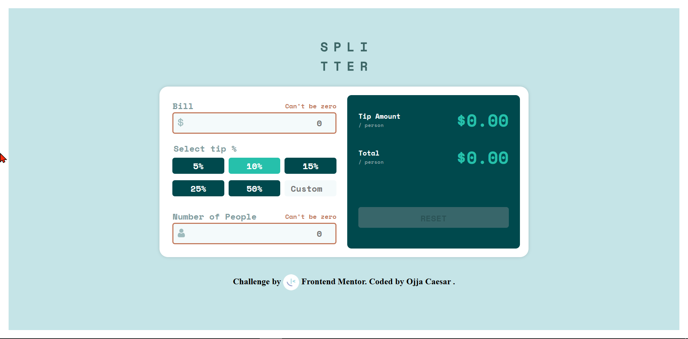
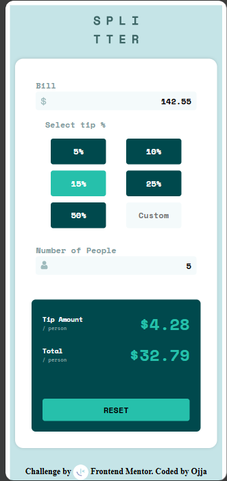

# Frontend Mentor - Tip calculator app solution

This is a solution to the [Tip calculator app challenge on Frontend Mentor](https://www.frontendmentor.io/challenges/tip-calculator-app-ugJNGbJUX). Frontend Mentor challenges help you improve your coding skills by building realistic projects.

## Table of contents

- [Frontend Mentor - Tip calculator app solution](#frontend-mentor---tip-calculator-app-solution)
	- [Table of contents](#table-of-contents)
	- [Overview](#overview)
		- [The challenge](#the-challenge)
		- [Screenshot](#screenshot)
		- [Links](#links)
	- [My process](#my-process)
		- [Built with](#built-with)
		- [What I learned](#what-i-learned)
		- [Continued development](#continued-development)
		- [Useful resources](#useful-resources)
	- [Author](#author)

## Overview

### The challenge

Users should be able to:

- View the optimal layout for the app depending on their device's screen size
- See hover states for all interactive elements on the page
- Calculate the correct tip and total cost of the bill per person

### Screenshot





### Links

- Solution URL: [checkout the source code](https://github.com/jidoG8/TIP-CALCULATOR-APP.git)
- Live Site URL: [Behold the live project](https://jidog8.github.io/TIP-CALCULATOR-APP/)

## My process

### Built with

- Semantic HTML5 markup
- CSS custom properties
- Flexbox
- CSS Grid
- Mobile-first workflow
- [JavaScript](https://web.dev/learn/forms/javascript?hl=en)

### What I learned

-Still Learning How to send data to web using JS

```html
<!-- BILL AMOUNT -->
<section class="bill">
	<label for="bill__input" class="bill__label">Bill</label>
	<span class="bill__input-error"></span>
	<section class="bill__container">
		
		<input
			type="number"
			id="bill__input"
			class="bill__input"
			placeholder="0"
			min="0"
		/>
	</section>
</section>
```

```css
/* ===== RESPONSIVE DESIGN ===== */
/* DESKTOPVIEW */
@media (min-width: 768px) {
	form {
		display: grid;
		grid-template-columns: repeat(2, 1fr);
		grid-template-rows: min-content;
		overflow: hidden;
		gap: 12px;
		width: 55%;
		max-width: 1440px;
	}

	fieldset {
		grid-template-columns: repeat(3, 1fr);
		grid-template-rows: repeat(2, 1fr);
	}

	.tip-amount__section {
		justify-content: space-between;
		height: 100%;
	}

	.tip-amount__reset {
		margin-top: auto;
		padding: 1em;
		margin-bottom: 18px;
		text-align: center;
	}

	input[type="reset"] {
		line-height: 1;
		padding-top: 0.8em;
		padding-bottom: 0.6em;
		height: auto;
	}
}
```

```js
/*___________USER INPUT VALIDATION___________*/

const toggleError = (input, errorElement, show) => {
	errorElement.style.display = show ? "block" : "none";
	errorElement.textContent = show ? "Can't be zero" : "";
	input.style.border = show ? "2px solid var(--errColor)" : "";

	// remove button & custom input highlight
	tipPercentages.forEach((btn) => {
		if (btn) btn.style.backgroundColor = "";
	});

	customInput.value = "";
};

const validateInput = (input, errorElement) => {
	const isZero = parseFloat(input.value) === 0;
	toggleError(input, errorElement, isZero);
	resetButton.disabled = !(billDue.value && clients.value && !isZero);
};

billDue.addEventListener("input", () =>
	validateInput(billDue, billErrorElement)
);
clients.addEventListener("input", () =>
	validateInput(clients, clientsErrorElement)
);
```

If you want more help with writing markdown, we'd recommend checking out [The Markdown Guide](https://www.markdownguide.org/) to learn more.

**Note: Delete this note and the content within this section and replace with your own learnings.**

### Continued development

Use this section to outline areas that you want to continue focusing on in future projects. These could be concepts you're still not completely comfortable with or techniques you found useful that you want to refine and perfect.

**Note: Delete this note and the content within this section and replace with your own plans for continued development.**

### Useful resources

- [MDN](https://developer.mozilla.org/en-US/docs/Web/JavaScript/Reference/Functions) - This helped me for XYZ reason. I really liked this pattern and will use it going forward.
- [Youtube](https://youtu.be/ndNPg8-5jgI?si=6ZuqiN7pbwv0qTaK) - I was able to follow this and design the form authentication as required.

## Author

- Frontend Mentor - [@jidoG8](https://www.frontendmentor.io/profile/jidoG8)
- Twitter - [@OjjaC1253](https://x.com/OjjaC1253)
- LinkedIn - [@ojja-caesar](https://www.linkedin.com/in/ojja-caesar-134980345/)
